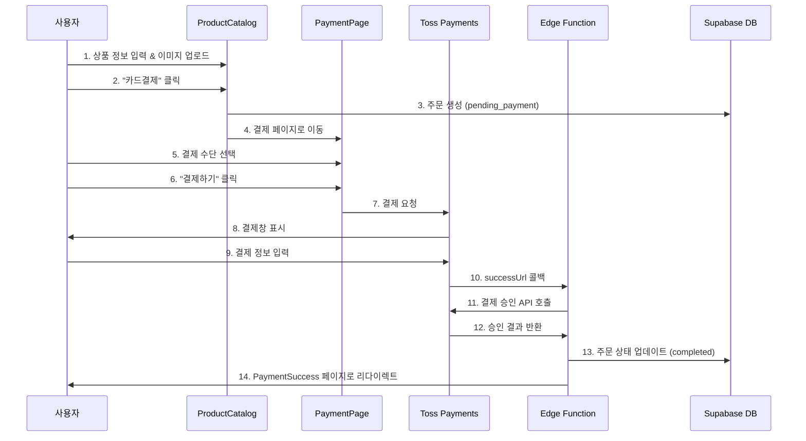

# 💳 Toss Payments 결제 시스템 연동 가이드

## 📋 목차
1. [개요](#개요)
2. [결제 흐름](#결제-흐름)
3. [파일 구조](#파일-구조)
4. [환경 설정](#환경-설정)
5. [데이터베이스 설정](#데이터베이스-설정)
6. [Edge Function 배포](#edge-function-배포)
7. [테스트 방법](#테스트-방법)
8. [문제 해결](#문제-해결)

---

## 개요

이 프로젝트는 **Toss Payments SDK・API 개별 연동 방식**을 사용하여 온라인 결제를 처리합니다.

### 주요 특징
- 🎨 **커스터마이즈 가능한 UI**: 결제 수단 선택 UI 직접 구현
- 🔒 **안전한 결제**: Supabase Edge Function을 통한 서버사이드 결제 승인
- 💰 **다양한 결제 수단**: 카드, 가상계좌, 계좌이체, 휴대폰 결제
- 📱 **반응형 디자인**: 모바일/데스크톱 최적화

### 사용 기술
- **Frontend**: React + Toss Payments SDK
- **Backend**: Supabase Edge Functions (Deno)
- **Database**: Supabase PostgreSQL
- **PG**: Toss Payments API

---

## 결제 흐름



### 상세 단계

#### 1️⃣ 주문 생성 ([ProductCatalog.jsx](src/pages/ProductCatalog.jsx))
```javascript
// 카드결제 버튼 클릭 시
const orderData = {
  product_id: product.id,
  employee_id: employee?.id || null,
  business_name: customerInfo.businessName,
  customer_name: customerInfo.name,
  customer_email: customerInfo.email,
  customer_phone: customerInfo.phone,
  naver_place_address: customerInfo.naverPlaceAddress,
  image_urls: uploadedImages,
  quantity: quantity,
  sale_price: product.price,
  sale_cost: product.cost || 0,
  total_amount: calculateTotal(product.price * quantity),
  status: 'pending_payment', // 결제 대기 상태
}
```

#### 2️⃣ 결제 페이지 이동
```javascript
navigate('/payment', {
  state: {
    orderData: {
      orderId: `ORDER-${order.id}`, // Toss 형식: 영문+숫자 6자 이상
      orderName: `${product.name} ${quantity}개`,
      amount: calculateTotal(product.price * quantity),
      customerName: customerInfo.name,
      customerEmail: customerInfo.email,
      customerPhone: customerInfo.phone,
    }
  }
})
```

#### 3️⃣ 결제 요청 ([PaymentPage.jsx](src/pages/PaymentPage.jsx))
```javascript
await tossPayments.requestPayment(selectedMethod, {
  amount: orderData.amount,
  orderId: orderData.orderId,
  orderName: orderData.orderName,
  customerName: orderData.customerName,
  customerEmail: orderData.customerEmail,
  customerMobilePhone: orderData.customerPhone,
  successUrl: `${window.location.origin}/payment/success`,
  failUrl: `${window.location.origin}/payment/fail`,
})
```

#### 4️⃣ 결제 승인 ([edge-function-index.ts](edge-function-index.ts))
```typescript
// Toss Payments 결제 승인 API 호출
const tossResponse = await fetch('https://api.tosspayments.com/v1/payments/confirm', {
  method: 'POST',
  headers: {
    'Authorization': `Basic ${btoa(TOSS_SECRET_KEY + ':')}`,
    'Content-Type': 'application/json',
  },
  body: JSON.stringify({
    paymentKey,
    orderId,
    amount: parseInt(amount),
  }),
})

// 주문 상태 업데이트
await supabase
  .from('orders')
  .update({
    status: 'completed',
    payment_key: paymentKey,
    payment_method: paymentData.method,
    payment_date: new Date().toISOString(),
  })
  .eq('id', actualOrderId)
```

---

## 파일 구조

### 📁 Frontend 파일

| 파일 | 역할 | 주요 기능 |
|------|------|----------|
| [src/pages/ProductCatalog.jsx](src/pages/ProductCatalog.jsx) | 상품 구매 페이지 | • 고객 정보 입력<br>• 이미지 업로드<br>• 주문 생성<br>• 카드결제/계좌이체 선택 |
| [src/pages/PaymentPage.jsx](src/pages/PaymentPage.jsx) | 결제 페이지 | • Toss SDK 초기화<br>• 결제 수단 선택 UI<br>• 결제 요청 처리 |
| [src/pages/PaymentSuccess.jsx](src/pages/PaymentSuccess.jsx) | 결제 성공 페이지 | • Edge Function 호출<br>• 결제 승인 처리<br>• 주문 정보 표시 |
| [src/pages/PaymentFail.jsx](src/pages/PaymentFail.jsx) | 결제 실패 페이지 | • 에러 정보 표시<br>• 재시도 옵션 제공 |
| [src/App.jsx](src/App.jsx) | 라우팅 설정 | • 결제 관련 라우트 정의<br>• 공개 경로 설정 |

### 📁 Backend 파일

| 파일 | 역할 | 설명 |
|------|------|------|
| [edge-function-index.ts](edge-function-index.ts) | Edge Function 코드 | • Toss Payments 결제 승인<br>• 주문 금액 검증<br>• 주문 상태 업데이트 |

### 📁 설정 파일

| 파일 | 용도 |
|------|------|
| [.env](.env) | 환경 변수 (클라이언트 키) |
| [add_payment_columns.sql](add_payment_columns.sql) | DB 스키마 추가 |
| [EDGE_FUNCTION_SETUP.md](EDGE_FUNCTION_SETUP.md) | Edge Function 배포 가이드 |
| [TOSS_PAYMENTS_SETUP.md](TOSS_PAYMENTS_SETUP.md) | 전체 설정 가이드 |

---

## 환경 설정

### 1. 환경 변수 (.env)

```bash
# Supabase 설정
VITE_SUPABASE_URL=https://epefbiexslkrvartpupx.supabase.co
VITE_SUPABASE_ANON_KEY=your_anon_key_here

# Toss Payments (클라이언트 키만)
VITE_TOSS_CLIENT_KEY=test_ck_LlDJaYngrozQb25nZxNKVezGdRpX
```

⚠️ **주의**: 시크릿 키(`test_sk_Z61JOxRQVEB467mvnoBwrW0X9bAq`)는 절대 클라이언트 코드나 `.env`에 넣지 마세요!

### 2. Toss Payments 키 정보

| 키 유형 | 값 | 사용 위치 |
|---------|-----|----------|
| **클라이언트 키** | `test_ck_LlDJaYngrozQb25nZxNKVezGdRpX` | Frontend (.env) |
| **시크릿 키** | `test_sk_Z61JOxRQVEB467mvnoBwrW0X9bAq` | Edge Function (환경 변수) |
| **보안 키** | `d0dfb285680696b55d1a9c82b0e8714a5292b8755f480a03c745d75cd04c0ac1` | Webhook (미사용) |

---

## 데이터베이스 설정

### 1. orders 테이블에 결제 관련 컬럼 추가

**Supabase SQL Editor**에서 다음 SQL 실행:

```sql
-- payment_key 컬럼 추가 (Toss Payments 결제 키)
ALTER TABLE orders
ADD COLUMN IF NOT EXISTS payment_key TEXT;

-- payment_method 컬럼 추가 (결제 수단: 카드, 가상계좌, 계좌이체, 휴대폰)
ALTER TABLE orders
ADD COLUMN IF NOT EXISTS payment_method TEXT;

-- payment_date 컬럼 추가 (결제 완료 일시)
ALTER TABLE orders
ADD COLUMN IF NOT EXISTS payment_date TIMESTAMPTZ;

-- 컬럼 확인
SELECT column_name, data_type
FROM information_schema.columns
WHERE table_name = 'orders'
ORDER BY ordinal_position;
```

또는 [add_payment_columns.sql](add_payment_columns.sql) 파일 실행

### 2. 주문 상태 (status) 값

| 상태 | 설명 |
|------|------|
| `pending_payment` | 결제 대기 (주문 생성 직후) |
| `completed` | 결제 완료 |
| `cancelled` | 주문 취소 |
| `refunded` | 환불 완료 |

---

## Edge Function 배포

### 방법 1: Supabase Dashboard (권장)

1. **Edge Function 생성**
   - Supabase Dashboard > Edge Functions
   - "Create a new function" 클릭
   - Function name: `payment-confirm`

2. **코드 배포**
   - `index.ts` 파일 열기
   - [edge-function-index.ts](edge-function-index.ts) 전체 내용 복사
   - 에디터에 붙여넣기 (기존 코드 교체)
   - **Save** → **Deploy** 클릭

3. **환경 변수 설정**
   - Project Settings > Edge Functions
   - Add new secret:
     - **Name**: `TOSS_SECRET_KEY`
     - **Value**: `test_sk_Z61JOxRQVEB467mvnoBwrW0X9bAq`
   - Save

4. **배포 확인**
   - Edge Functions에서 상태 확인
   - Endpoint URL: `https://epefbiexslkrvartpupx.supabase.co/functions/v1/payment-confirm`

### 방법 2: CLI (선택사항)

```bash
# Supabase 로그인
npx supabase login

# Edge Function 배포
npx supabase functions deploy payment-confirm --project-ref epefbiexslkrvartpupx

# 환경 변수 설정
npx supabase secrets set TOSS_SECRET_KEY=test_sk_Z61JOxRQVEB467mvnoBwrW0X9bAq --project-ref epefbiexslkrvartpupx
```

---

## 테스트 방법

### 1. 개발 서버 실행

```bash
npm run dev
```

### 2. 테스트 URL

```
http://localhost:3000/product/1?ref=E001
```

- `1`: 상품 ID
- `E001`: 직원 코드 (employees 테이블)

### 3. 테스트 절차

1. **고객 정보 입력**
   - 상호명: 테스트 상호
   - 이름: 홍길동
   - 전화번호: 010-1234-5678
   - 이메일: test@example.com
   - 네이버 플레이스: https://naver.me/test

2. **이미지 업로드** (1~5개)

3. **카드결제 버튼 클릭**

4. **결제 수단 선택**
   - 카드
   - 가상계좌
   - 계좌이체
   - 휴대폰

5. **결제하기 버튼 클릭**

6. **Toss Payments 결제창**에서 테스트 카드 입력

### 4. 테스트 카드 정보

| 카드사 | 카드번호 | 유효기간 | CVC | 비밀번호 |
|--------|----------|----------|-----|----------|
| 신한 | `9446-0178-9269-2489` | 아무거나 | 아무거나 | 아무거나 |
| 국민 | `9430-0600-3911-0012` | 아무거나 | 아무거나 | 아무거나 |
| 하나 | `9436-9560-0523-5106` | 아무거나 | 아무거나 | 아무거나 |

⚠️ **테스트 환경**에서는 실제 결제가 발생하지 않습니다.

### 5. 결제 성공 확인

- PaymentSuccess 페이지로 리다이렉트
- 주문 정보 표시
- 결제 정보 확인
- Supabase DB에서 `orders` 테이블 확인:
  ```sql
  SELECT id, status, payment_key, payment_method, payment_date
  FROM orders
  ORDER BY created_at DESC
  LIMIT 1;
  ```

---

## 문제 해결

### 일반적인 오류

#### 1. `orderId` 형식 오류
```
Error: orderId는 영문 대소문자, 숫자, 특수문자(-, _) 만 허용합니다.
```

**원인**: `orderId`가 숫자만 있거나 6자 미만

**해결**:
```javascript
// ❌ 잘못된 형식
orderId: order.id.toString() // "123"

// ✅ 올바른 형식
orderId: `ORDER-${order.id}` // "ORDER-123"
```

#### 2. `sale_price` 또는 `sale_cost` NULL 오류
```
Error: null value in column "sale_price" violates not-null constraint
```

**원인**: 주문 생성 시 필수 컬럼 누락

**해결**:
```javascript
const orderData = {
  // ... 기타 필드
  sale_price: product.price,      // 필수
  sale_cost: product.cost || 0,   // 필수
}
```

#### 3. Edge Function 호출 실패
```
Error: Failed to fetch
```

**원인**:
- Edge Function이 배포되지 않음
- 환경 변수 미설정
- CORS 문제

**해결**:
1. Edge Function 배포 확인
2. `TOSS_SECRET_KEY` 환경 변수 확인
3. Edge Function Logs 확인

#### 4. 결제 승인 실패
```
Error: 결제 승인 실패
```

**원인**:
- Toss Payments 시크릿 키 오류
- 주문 금액 불일치
- 네트워크 오류

**해결**:
1. Supabase Edge Function Logs 확인
2. 시크릿 키 재확인
3. 주문 금액 검증 로직 확인

### 디버깅 방법

#### Frontend 디버깅
```javascript
// PaymentPage.jsx
console.log('주문 정보:', orderData)

// PaymentSuccess.jsx
console.log('결제 파라미터:', { paymentKey, orderId, amount })
```

#### Backend 디버깅
```typescript
// Edge Function
console.log('결제 승인 요청:', { paymentKey, orderId, amount })
console.log('주문 조회 결과:', order)
console.log('Toss 응답:', paymentData)
```

Supabase Dashboard > Edge Functions > payment-confirm > **Logs** 탭에서 확인

---

## 주요 함수 및 컴포넌트

### ProductCatalog.jsx

#### `handleCardPayment()`
카드결제 주문 생성 및 결제 페이지 이동

```javascript
const handleCardPayment = async () => {
  // 1. 유효성 검증
  // 2. 주문 생성 (pending_payment)
  // 3. 결제 페이지로 이동
}
```

#### `handleBankTransfer()`
계좌이체 주문 생성 및 계좌 정보 모달 표시

### PaymentPage.jsx

#### `loadTossPayments()`
Toss Payments SDK 초기화

```javascript
const tossPaymentsInstance = await loadTossPayments(clientKey)
```

#### `handlePayment()`
결제 요청

```javascript
await tossPayments.requestPayment(selectedMethod, { ... })
```

### PaymentSuccess.jsx

#### `confirmPayment()`
결제 승인 처리

```javascript
// 1. URL 파라미터 추출
// 2. Edge Function 호출
// 3. 주문 정보 조회
// 4. 성공 페이지 표시
```

### Edge Function (edge-function-index.ts)

```typescript
serve(async (req) => {
  // 1. CORS 처리
  // 2. orderId 파싱 (ORDER-123 -> 123)
  // 3. 주문 금액 검증
  // 4. Toss Payments 결제 승인
  // 5. 주문 상태 업데이트
  // 6. 응답 반환
})
```

---

## 보안 고려사항

### ✅ DO (해야 할 것)

1. **시크릿 키 관리**
   - Edge Function에서만 사용
   - 환경 변수로 관리
   - Git에 커밋하지 않기

2. **금액 검증**
   - Edge Function에서 이중 검증
   - 주문 금액과 결제 금액 일치 확인

3. **주문 상태 관리**
   - 중복 결제 방지 (completed 체크)
   - 상태 전이 검증

### ❌ DON'T (하지 말아야 할 것)

1. **클라이언트에서 직접 승인**
   ```javascript
   // ❌ 절대 하지 마세요!
   fetch('https://api.tosspayments.com/v1/payments/confirm', {
     headers: {
       'Authorization': `Basic ${btoa(SECRET_KEY + ':')}` // 위험!
     }
   })
   ```

2. **시크릿 키 노출**
   ```javascript
   // ❌ 절대 하지 마세요!
   const SECRET_KEY = 'test_sk_...' // .env나 코드에 직접 입력
   ```

3. **금액 검증 생략**
   ```typescript
   // ❌ 위험!
   // 클라이언트가 보낸 금액을 그대로 신뢰
   ```

---

## 참고 자료

### 공식 문서
- [Toss Payments 개발자 문서](https://docs.tosspayments.com/)
- [SDK・API 연동 가이드](https://docs.tosspayments.com/guides/v2/payment-sdk)
- [결제 승인 API](https://docs.tosspayments.com/reference#confirm)
- [Supabase Edge Functions](https://supabase.com/docs/guides/functions)

### 프로젝트 문서
- [TOSS_PAYMENTS_SETUP.md](TOSS_PAYMENTS_SETUP.md) - 전체 설정 가이드
- [EDGE_FUNCTION_SETUP.md](EDGE_FUNCTION_SETUP.md) - Edge Function 배포 가이드
- [add_payment_columns.sql](add_payment_columns.sql) - DB 스키마

### 테스트 도구
- [Toss Payments 개발자센터](https://developers.tosspayments.com/)
- [테스트 카드 정보](https://docs.tosspayments.com/guides/v2/development/test-card)

---

## FAQ

### Q1. 프로덕션 배포 시 변경할 것은?
1. Toss Payments 실제 키로 변경
2. `.env`의 `VITE_TOSS_CLIENT_KEY` 업데이트
3. Edge Function 환경 변수 `TOSS_SECRET_KEY` 업데이트
4. `successUrl`, `failUrl` 실제 도메인으로 변경

### Q2. 환불은 어떻게 처리하나요?
Toss Payments 결제 취소 API를 사용:
```typescript
fetch('https://api.tosspayments.com/v1/payments/{paymentKey}/cancel', {
  method: 'POST',
  headers: {
    'Authorization': `Basic ${btoa(SECRET_KEY + ':')}`,
    'Content-Type': 'application/json',
  },
  body: JSON.stringify({
    cancelReason: '환불 사유'
  })
})
```

### Q3. 가상계좌 입금 확인은?
Webhook을 설정하여 입금 완료 알림 수신:
1. Toss Payments 개발자센터에서 Webhook URL 설정
2. Edge Function 생성 (webhook 처리)
3. 입금 완료 시 주문 상태 업데이트

### Q4. 테스트와 프로덕션 키 구분은?
- 테스트: `test_ck_...`, `test_sk_...`
- 프로덕션: `live_ck_...`, `live_sk_...`

환경 변수로 분리하여 관리 권장

---

## 버전 정보

- **Toss Payments SDK**: `@tosspayments/payment-sdk@latest`
- **Supabase**: `@supabase/supabase-js@2.39.0`
- **React**: `19.2.0`
- **Deno**: `std@0.177.0`

---

## 라이선스

이 프로젝트는 MIT 라이선스를 따릅니다.

---

**작성일**: 2025-10-11
**작성자**: Claude Code
**프로젝트**: Sales Management System
